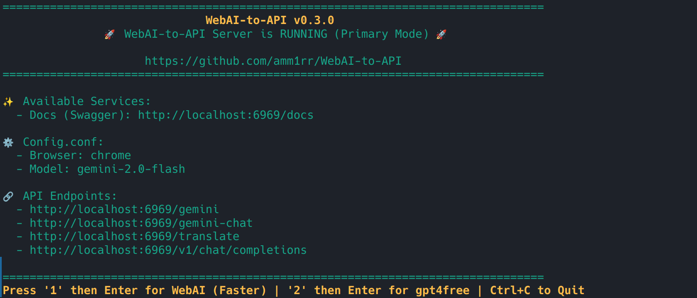
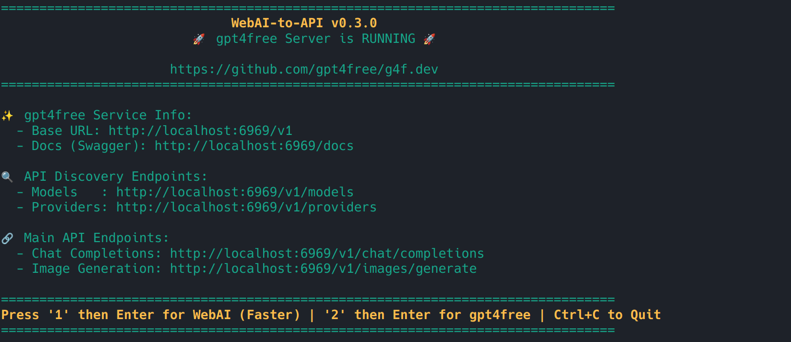

## 免责声明

> **本项目仅供研究和教育用途。**
> 请勿用于任何商业目的，并在部署或修改本工具时承担相应责任。

---

# WebAI-to-API（中文版）

[English](./README.md) | **简体中文**

<p align="center">
  
  
</p>

**WebAI-to-API** 是一个基于 FastAPI 构建的模块化 Web 服务器，可以将浏览器版 LLM（主要是 Google Gemini）封装为本地 API 端点对外提供服务。

---

## 🌟 本 Fork 的核心增强：多模态文件上传

> 这是**原仓库（[Amm1rr/WebAI-to-API](https://github.com/Amm1rr/WebAI-to-API)）所不具备的功能**，也是本 fork 最主要的价值所在。

原版仓库只支持纯文本对话。本 fork 通过反向工程 Gemini Web 协议，在保留原有所有功能的基础上，**完整支持向 Gemini 上传图片、PDF、视频和音频**，并提供三种可互换的传入方式以适配不同客户端：

| 能力 | 原仓库 | 本 Fork |
|---|:---:|:---:|
| 纯文本对话 | ✅ | ✅ |
| **图片上传（JPG/PNG/WebP 等）** | ❌ | ✅ |
| **PDF 文档上传** | ❌ | ✅ |
| **视频上传（MP4 等）** | ❌ | ✅ |
| **音频上传（MP3/WAV 等）** | ❌ | ✅ |
| **OpenAI 兼容的多模态格式（`image_url`）** | ❌ | ✅ |
| **multipart/form-data 上传** | ❌ | ✅ |
| **JSON + base64 内嵌文件** | ❌ | ✅ |
| 上传大小可配置上限 | ❌ | ✅ |
| 视频长响应的看门狗超时配置 | ❌ | ✅ |

详细使用方法见下文 [文件上传](#文件上传) 一节。

---

## 工作模式

本项目支持两种运行模式：

1. **主服务器（WebAI-to-API）**

   使用浏览器 Cookie 连接 Gemini 网页端，并以 API 端点的形式对外暴露。轻量、快速，适合个人使用。

2. **回退服务器（gpt4free）**

   基于 [gpt4free](https://github.com/xtekky/gpt4free) 库，提供对 Gemini 之外更多 LLM 的访问能力，包括：

   - ChatGPT
   - Claude
   - DeepSeek
   - Copilot
   - HuggingFace Inference
   - Grok
   - ……以及更多

这种双模式设计兼顾**速度与冗余**，可以根据使用场景灵活切换。

---

## 功能特性

- 🌐 **可用端点**：

  - **WebAI 服务器**：
    - `/v1/chat/completions`
    - `/gemini`
    - `/gemini-chat`
    - `/translate`
    - `/v1beta/models/{model}` （Google Generative AI v1beta API）

  - **gpt4free 服务器**：
    - `/v1`
    - `/v1/chat/completions`

- 🔄 **服务器切换**：可在终端中通过键盘输入快速切换两种模式。

- 📎 **文件上传（本 fork 特有）**：所有 WebAI 端点均支持图片、PDF、视频、音频，三种传入方式可选 —— `multipart/form-data`、JSON 内嵌 base64、OpenAI 风格的 `image_url`。详见 [文件上传](#文件上传)。

- 🛠️ **模块化架构**：API 路由、服务层、配置、工具函数清晰分离，便于二次开发与维护。

<p align="center">
  
</p>

---

## 安装

1. **克隆仓库：**

   ```bash
   git clone https://github.com/Amm1rr/WebAI-to-API.git
   cd WebAI-to-API
   ```

2. **使用 Poetry 安装依赖：**

   ```bash
   poetry install
   ```

3. **创建并修改配置文件：**

   ```bash
   cp config.conf.example config.conf
   ```

   然后编辑 `config.conf` 调整服务配置等选项。

4. **启动服务器：**

   ```bash
   poetry run python src/run.py
   ```

---

## 鉴权（Authentication）

WebAI-to-API 的端点支持可选的 API Key 鉴权，通过环境变量 `GEMINI_API_KEY` 开启。

- **禁用（默认）**：未设置或为空时，所有端点开放访问，适合本地使用。
- **启用**：设置后，访问 `/gemini`、`/gemini-chat`、`/translate`、`/v1/*`、`/v1beta/models/*` 都必须携带匹配的 Key，否则返回 `401 Unauthorized`。

### 设置 Key

```bash
# Linux / macOS
export GEMINI_API_KEY="your-secret-key"
poetry run python src/run.py
```

```powershell
# Windows PowerShell
$env:GEMINI_API_KEY = "your-secret-key"
poetry run python src/run.py
```

```bash
# Docker
docker run -e GEMINI_API_KEY="your-secret-key" -p 6969:6969 webai-to-api
```

### 客户端如何传递 Key

下列任意一种都被接受，按客户端习惯选择即可：

| Header / 参数                  | 风格                   | 典型客户端                            |
| ------------------------------ | ---------------------- | ------------------------------------ |
| `Authorization: Bearer <key>`  | OpenAI 兼容            | OpenAI SDK、`/v1/chat/completions`   |
| `x-goog-api-key: <key>`        | Google Generative AI   | `@google/generative-ai`、`/v1beta/*` |
| `x-api-key: <key>`             | 通用                   | curl、自定义客户端                   |
| `?key=<key>` 查询参数          | Google 查询参数        | 浏览器测试                           |

> 注：鉴权仅作用于 WebAI-to-API 服务器。`gpt4free` 回退服务器是独立进程，不受 `GEMINI_API_KEY` 控制。

---

## 文件上传

`/gemini`、`/gemini-chat`、`/translate`、`/v1/chat/completions` 四个端点都支持文件附件 —— 图片、PDF、视频、音频，提供三种可互换的传入形式，按客户端方便选择即可。

### 前提：Cookie 配置

文件上传通常**只需要和纯文本对话一样的两个 Cookie**：

```ini
[Cookies]
gemini_cookie_1psid = <__Secure-1PSID 值>
gemini_cookie_1psidts = <__Secure-1PSIDTS 值>
```

`gemini-webapi` 在 `init()` 时会用这两个 Cookie 自动从 `gemini.google.com` bootstrap 拉到媒体上传所需的 SAPISID 系 Cookie（`SAPISID`、`__Secure-1PAPISID`、`__Secure-3PAPISID` 等），不需要手动配置。

#### 兜底选项：`gemini_cookie_extra`（一般用不到）

只有当 bootstrap 拉取的 Cookie 不全、上传出现 `APIError 1099` 或卡到看门狗超时时，才需要手动补一份完整的浏览器 Cookie 作为兜底。配置方法：

1. 在常规浏览器中用与 `gemini_cookie_1psid` 同一个 Google 账号登录 https://gemini.google.com 。
2. 打开开发者工具 → Network → 任意发送一条聊天消息。
3. 找一个发往 `gemini.google.com/_/BardChatUi/...` 的请求 → 右键 → Copy → Copy as cURL (bash)。
4. 找到其中的 `-H 'Cookie: <长字符串>'`，复制单引号之间 **`Cookie: ` 后面的整段字符串**。
5. 粘贴为 `config.conf` 的一行：

```ini
gemini_cookie_extra = SAPISID=...; __Secure-1PAPISID=...; SID=...; HSID=...; SSID=...; APISID=...; __Secure-3PAPISID=...; <…>
```

6. 重启服务器后启动日志会出现 `Injected N extra cookies into Gemini session.`。

> ⚠️ **`gemini_cookie_extra` 中的字符串等同于账号密码。** 请像对待密钥一样对待 `config.conf`：`chmod 600`、加入 `.gitignore`、绝不要提交或分享。Cookie 通常能用数天到数周才需要刷新。

### 1. `multipart/form-data`（浏览器和 curl 推荐）

普通表单字段 + 一个或多个 `files` 字段。保留原始文件名，MIME 类型自动识别。

```bash
# 图片
curl -F message="这张图里是什么？" -F model=gemini-3-flash \
     -F files=@photo.jpg \
     http://localhost:6969/gemini

# 多文件（图片 + PDF）
curl -F message="对比这两个文档" -F model=gemini-3-pro \
     -F files=@report.pdf -F files=@chart.png \
     http://localhost:6969/gemini-chat

# 视频
curl -F message="总结这段视频" -F model=gemini-3-pro \
     -F files=@demo.mp4 \
     http://localhost:6969/gemini
```

### 2. JSON + base64 内嵌文件

`files` 数组中的每一项既可以是服务器端文件路径字符串（旧行为兼容），**也可以是带 base64 内容的对象**。字节流务必带 `filename`，以便正确识别 MIME 类型。

```json
POST /gemini
Content-Type: application/json

{
  "message": "描述这张图片",
  "model": "gemini-3-flash",
  "files": [
    {
      "filename": "photo.jpg",
      "content_base64": "/9j/4AAQSkZJRgABAQEASABIAAD..."
    },
    "/absolute/path/already/on/server.pdf"
  ]
}
```

`content_base64` 也可以是完整的 Data URL（如 `"data:image/png;base64,iVBORw0KGgo..."`）。

### 3. OpenAI 兼容的多模态格式（仅 `/v1/chat/completions`）

标准的 OpenAI Vision 格式开箱即用 —— `image_url` 同时接受 `data:` URL 和 `http(s)://` URL（服务器会自行抓取）。

```json
POST /v1/chat/completions
Content-Type: application/json

{
  "model": "gemini-3-pro",
  "messages": [
    {
      "role": "user",
      "content": [
        { "type": "text", "text": "这张图里是什么？" },
        { "type": "image_url", "image_url": { "url": "data:image/png;base64,iVBORw0..." } }
      ]
    }
  ]
}
```

`/v1/chat/completions` 还额外支持 `multipart/form-data` 变体 —— 把 OpenAI 风格的 JSON 体作为 `payload` 字段发送，附加一个或多个 `files`：

```bash
curl http://localhost:6969/v1/chat/completions \
  -F 'payload={"model":"gemini-3-flash","messages":[{"role":"user","content":"描述"}]};type=application/json' \
  -F files=@photo.jpg
```

### 大小限制

单次请求总上传体积由 `[Server] max_upload_size_mb` 控制（默认 **100 MB**，设为 `0` 关闭检查）。超出会被拒绝并返回 `413 Payload Too Large`。如果前面接了 nginx 等反向代理，请相应调高 `client_max_body_size`。

### 已知限制与排错

文件上传基于反向工程 Google 当前 Gemini Web 协议的补丁实现（见 `src/app/services/gemini_patch.py`）。该协议非官方，Google 可能随时修改，因此这一层本质上是脆弱的。

| 现象 | 可能原因 | 解决方案 |
|---|---|---|
| 卡约 2 分钟，日志显示 `Watchdog … Stream suspended` | Cookie 不全 / 缺 SAPISID 全家族 | 重新从浏览器复制完整 `Cookie:` 头粘贴到 `gemini_cookie_extra` |
| `APIError 1099` | 上传协议不匹配 | 确认补丁已加载（启动时应有 `[patch] gemini_webapi.upload_file -> resumable …`）；缺失则重建镜像 |
| `er` 帧返回 `INVALID_ARGUMENT 400` | Body 或 Header 布局不匹配（很可能 Google 改协议） | 通过 Fiddler / DevTools HAR 重新抓取浏览器的可用请求，与 `gemini_patch.py` 对比 |
| 模型回复 “我看不到视频/图片” | Cookie 有效但账号/地区不支持媒体 | 先在浏览器里确认上传能用；浏览器里也不行说明账号等级受限 |
| `503 Gemini cookies not found` | `config.conf` 缺失或为空 | 重新填充 Cookie，并确认容器内能访问到（建议 volume 挂载，避免每次重建） |

**调试模式**：设置环境变量 `WEBAI_DEBUG_DUMP_REQUEST=1` 可以把每次带附件请求的完整 StreamGenerate 出站请求（URL + Header + Body，**包括实时 Cookie**）打到日志。仅用于一次性排错，长开会把账号密码级别的数据写进日志。

**Cookie 轮换**：Google 每隔几分钟会轮换一次 `__Secure-1PSIDTS`。`gemini-webapi` 默认开启 `auto_refresh=True`（间隔 600 秒），会在后台调用 Google 的 rotate 端点，更新内存中的 cookie，并把新值写入缓存文件 `$GEMINI_COOKIE_PATH/.cached_cookies_<PSID>.json`。下次 `init()` 时库会**优先**读这个缓存而不是 `config.conf` 中的值，所以即使进程重启也能继续用最新的会话。

`src/run.py` 已经把 `GEMINI_COOKIE_PATH` 默认指向 `./data/gemini_cache/`，让缓存落在项目目录内，而不是系统临时目录（容易被清理）。Docker 部署同样在 `docker-compose.yml` 里设了这个环境变量，并把 `./data` 挂载为 volume —— **没有这个挂载**，容器每次重启都会丢失轮换后的 cookie，只能用 `config.conf` 里那条早已作废的初始值，从而触发 `AuthError`。

注意：自动轮换只覆盖 `__Secure-1PSIDTS`。`gemini_cookie_extra` 中的其它 Cookie **不会自动刷新**。如果用了几周后上传开始失败，请从浏览器重新粘贴 `gemini_cookie_extra`。

**Worker 数量**：请使用 `--workers 1`。每个 uvicorn worker 持有独立的 Gemini 会话和独立的 cookie 轮换循环，多 worker 会导致各进程之间的 `1PSIDTS` 状态不一致，并可能因为重复请求 rotate 端点而被 Google 限流。单 worker 下 FastAPI 的 async 协程足以承载并发请求。

**长视频 / 长响应超时**：gemini-webapi 的 stream 看门狗默认 120 秒。对于较大视频（几十 MB）Google 流式响应可能需要更久，可用 `WEBAI_WATCHDOG_TIMEOUT` 调高：

```yaml
# docker-compose.yml
services:
  webai:
    environment:
      - WEBAI_WATCHDOG_TIMEOUT=600   # 10 分钟；处理视频时推荐
```

或者写到 `.env`：

```
WEBAI_WATCHDOG_TIMEOUT=600
```

需要调高的典型症状：`[Watchdog] Connection idle for 120s … Stream suspended`，并伴随末尾出现 `parse_response_by_frame: Incomplete frame …`。推荐取值：`120`（默认、纯文本）、`240`（偶尔有图片）、`600`（视频）、`900`（大视频 + 详细分析）。

---

## 用法

向 `/v1/chat/completions`（或任意可用端点）发送 POST 请求即可。

### 支持的模型

| 模型                        | 说明                  |
| --------------------------- | --------------------- |
| `gemini-3.0-pro`            | 最强模型              |
| `gemini-3.0-flash`          | 快速高效（默认）      |
| `gemini-3.0-flash-thinking` | 推理增强模型          |

### 基本请求示例

```json
{
  "model": "gemini-3.0-pro",
  "messages": [{ "role": "user", "content": "你好！" }]
}
```

### 带系统提示词和对话历史的请求示例

```json
{
  "model": "gemini-3.0-flash-thinking",
  "messages": [
    { "role": "system", "content": "你是一个乐于助人的助手。" },
    { "role": "user", "content": "Python 是什么？" },
    { "role": "assistant", "content": "Python 是一门编程语言。" },
    { "role": "user", "content": "好学吗？" }
  ]
}
```

### 响应示例

```json
{
  "id": "chatcmpl-12345",
  "object": "chat.completion",
  "created": 1693417200,
  "model": "gemini-3.0-pro",
  "choices": [
    {
      "message": {
        "role": "assistant",
        "content": "你好！"
      },
      "finish_reason": "stop",
      "index": 0
    }
  ],
  "usage": {
    "prompt_tokens": 0,
    "completion_tokens": 0,
    "total_tokens": 0
  }
}
```

---

## 端点说明

### WebAI-to-API 端点

> `POST /gemini`

发起一次新的对话。每次请求都会**新建 session**，适合无状态调用。

> `POST /gemini-chat`

在持久 session 中继续对话，**保留上下文**。适合多轮对话场景。

> `POST /translate`

为 [Translate It!](https://github.com/iSegaro/Translate-It) 浏览器扩展量身打造，行为与 `/gemini-chat` 一致，**保持 session 上下文**。

> `POST /v1/chat/completions`

**OpenAI 兼容端点**，完整支持：
- **系统提示词**：设定助手行为与上下文
- **对话历史**：多轮 user/assistant 消息保留上下文
- **流式响应**：可选开启

适合各种期望 OpenAI API 格式的客户端无缝接入。

> `POST /v1beta/models/{model}`

**Google Generative AI v1beta API** 兼容端点，标准 Google API 格式（含 safety ratings、结构化响应）。

---

### gpt4free 端点

这些端点遵循 **OpenAI 兼容结构**，由 `gpt4free` 库提供动力。详细用法和定制化请参考官方文档：

- 📄 [Provider Documentation](https://github.com/gpt4free/g4f.dev/blob/main/docs/selecting_a_provider.md)
- 📄 [Model Documentation](https://github.com/gpt4free/g4f.dev/blob/main/docs/providers-and-models.md)

#### 可用端点（gpt4free API 层）

```
GET  /                              # 健康检查
GET  /v1                            # 版本信息
GET  /v1/models                     # 列出所有模型
GET  /api/{provider}/models         # 列出某个 provider 的模型
GET  /v1/models/{model_name}        # 模型详情

POST /v1/chat/completions           # 默认配置的对话
POST /api/{provider}/chat/completions
POST /api/{provider}/{conversation_id}/chat/completions

POST /v1/responses                  # 通用响应端点
POST /api/{provider}/responses

POST /api/{provider}/images/generations
POST /v1/images/generations
POST /v1/images/generate            # 用指定 provider 生成图片

POST /v1/media/generate             # 媒体生成（音频/视频等）

GET  /v1/providers                  # 列出所有 provider
GET  /v1/providers/{provider}

POST /api/{path_provider}/audio/transcriptions
POST /v1/audio/transcriptions       # 语音转文字

POST /api/markitdown                # Markdown 渲染

POST /api/{path_provider}/audio/speech
POST /v1/audio/speech               # 文字转语音

POST /v1/upload_cookies             # 上传 session cookies（基于浏览器的鉴权）

GET  /v1/files/{bucket_id}
POST /v1/files/{bucket_id}

GET  /v1/synthesize/{provider}      # 音频合成

POST /json/{filename}               # 提交结构化 JSON

GET  /media/{filename}
GET  /images/{filename}
```

---

## Roadmap

- ✅ 持续维护

---

<details>
  <summary>
    <h2>配置说明 ⚙️</h2>
  </summary>

### 关键配置项

| Section     | Option                | 说明                                                  | 示例值                  |
| ----------- | --------------------- | ----------------------------------------------------- | ----------------------- |
| [AI]        | default_ai            | `/v1/chat/completions` 默认服务                       | `gemini`                |
| [Browser]   | name                  | 用于 cookie 鉴权的浏览器                              | `firefox`               |
| [EnabledAI] | gemini                | 是否启用 Gemini 服务                                  | `true`                  |
| [Proxy]     | http_proxy            | Gemini 连接代理（可选）                               | `http://127.0.0.1:2334` |
| [Server]    | max_upload_size_mb    | 单请求上传体积上限（MB，`0` 关闭检查）                | `100`                   |

完整配置模板见 [`WebAI-to-API/config.conf.example`](WebAI-to-API/config.conf.example)。
若 Cookie 留空，程序会通过 `browser_cookies3` 从默认浏览器自动获取。

---

### `config.conf` 示例

```ini
[AI]
# 默认 AI 服务
default_ai = gemini

# Gemini 默认模型（可选：gemini-3.0-pro / gemini-3.0-flash / gemini-3.0-flash-thinking）
default_model_gemini = gemini-3.0-flash

# Gemini cookies（留空则使用 browser_cookies3 自动获取）
gemini_cookie_1psid =
gemini_cookie_1psidts =

[EnabledAI]
gemini = true

[Browser]
# 可选项：firefox / brave / chrome / edge / safari
name = firefox

# --- 代理配置 ---
# 连接 Gemini 服务器的可选代理，用于解决 403 等连接受限问题
[Proxy]
http_proxy =

# --- 服务器设置 ---
# 单次请求上传文件总体积上限（MB）
# 适用于 multipart、base64 内嵌、image_url 抓取
# 设为 0 关闭检查
[Server]
max_upload_size_mb = 100
```

</details>

---

## 项目结构

项目采用模块化布局，配置、业务逻辑、API 端点、工具函数清晰分离：

```plaintext
src/
├── run.py                         # 启动入口
├── app/
│   ├── __init__.py
│   ├── main.py                    # FastAPI app 创建、配置、lifespan 管理
│   ├── config.py                  # 全局配置加载/更新
│   ├── logger.py                  # 集中式日志配置
│   ├── auth.py                    # 🆕 GEMINI_API_KEY 鉴权（Bearer / x-goog-api-key / x-api-key / ?key=）
│   ├── endpoints/                 # API 路由
│   │   ├── gemini.py              # Gemini 相关端点（/gemini、/gemini-chat）
│   │   ├── chat.py                # 翻译及 OpenAI 兼容端点（/translate、/v1/chat/completions）
│   │   └── google_generative.py   # Google Generative AI v1beta API（/v1beta/models/*）
│   ├── services/                  # 业务逻辑与服务封装
│   │   ├── gemini_client.py       # Gemini 客户端初始化、内容生成、清理
│   │   ├── gemini_patch.py        # 🆕 反向工程的 monkey patch：修复 gemini-webapi 与
│   │   │                          #     Google 当前媒体上传/StreamGenerate 协议的不兼容，
│   │   │                          #     是文件上传能跑通的关键
│   │   └── session_manager.py     # 聊天与翻译的 session 管理
│   └── utils/
│       ├── browser.py             # 浏览器 Cookie 抓取
│       └── files.py               # 🆕 文件输入归一化：包装为带文件名的 FileBlob，写入
│                                  #     临时目录让 mimetypes 正确识别（避免 octet-stream
│                                  #     被 Google 拒绝）
├── models/                        # 模型封装（如 MyGeminiClient）
│   └── gemini.py
└── schemas/                       # Pydantic 请求/响应 schema
    └── request.py

config.conf                         # 应用配置（位于项目根目录）
```

> 🆕 标注的文件是本 fork 相对原仓库新增的部分，分别承担鉴权、上传协议补丁、文件输入归一化三项工作。

---

## 🐳 Docker 部署

详细的 Docker 部署说明见 [Docker.md](Docker.md)。

在 Docker 中启用 API Key 鉴权，把 `GEMINI_API_KEY` 写到 `.env`（或在 shell 启动时传入）：

```bash
# 持久化：写到 .env，然后启动
echo 'GEMINI_API_KEY=your-secret-key' >> .env
make up

# 临时：shell 覆盖，优先级高于 .env
GEMINI_API_KEY=your-secret-key docker-compose up -d
```

把 `GEMINI_API_KEY` 留空或不设置即可关闭鉴权。客户端如何传 Key 见 [鉴权](#鉴权authentication) 一节。

---

## Star History

[](https://www.star-history.com/#Amm1rr/WebAI-to-API&Date)

## License 📜

本项目基于 [MIT License](LICENSE) 开源。

---

> **注意：** 这是一个研究性项目。请负责任地使用，并意识到生产环境部署需要额外的安全加固与错误处理。
